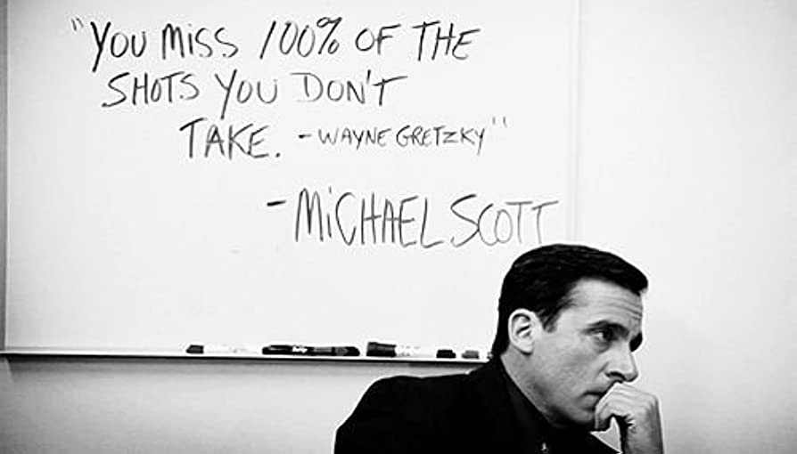

# Hi there 👋 
## Currently studying to become a mobile dev. 
### Here you can see my journey from zero to (someday) hero 😎

- 🔭 I’m currently working on different projects in React Native.
- 🌱 I’m currently learning Kotlin and Android Studio. Maybe look into Flutter after that...
- 📫 How to reach me: [LinkedIn](https://www.linkedin.com/in/oskar-hultman/) 
- ⚡ Fun fact: The Mona Lisa has no eyebrows. ...

